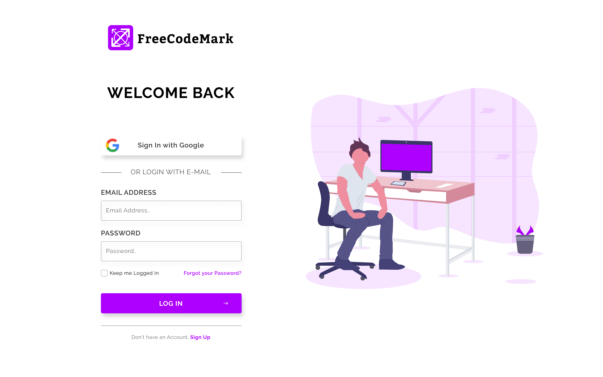
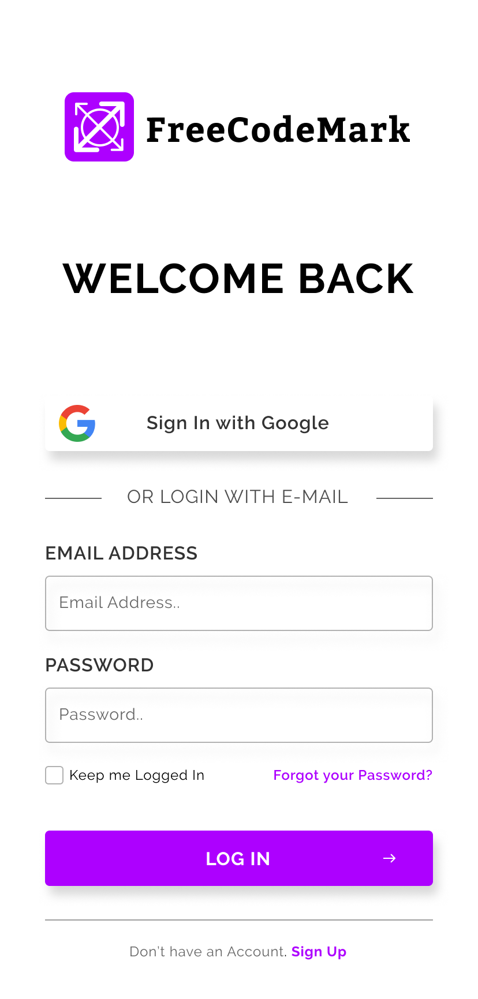

# Project Introduction

Our Goal is to create a Simple Login with basic Functionality. The Web Page should be Responsive for Mobile Viewports as well. All necessary assets and basic setup has been provided to you as well as the final result that you should create in the images below:

WEB VIEW                               |  Mobile View
:-------------------------------------:|:-------------------------------------:
  |

For the Functionality we encourage you to use Vanilla JavaScript and avoid the use of Jquery. The folder has been set up for SaSS, meaning you need to have some Sass Knowledge. In case you don't know Sass, we recommend the folllowing Video Tutorials from Youtube, in that order:

* [Tutorial 1](https://www.youtube.com/watch?v=roywYSEPSvc&t=2s)
* [Tutorial 3](https://www.youtube.com/watch?v=Rnxyf6Vyqiw)
* [Tutorial 2](https://www.youtube.com/watch?v=wz3kElLbEHE)

Now you are ready to dive in to the Project.

### Think of it as a contest.

Meaning, while there are no prizes, you will be able to see what your fellow Campers did, and improve and learn from them. Below you will find:

* Installation Instructions for the Development Environment we setup for you.
* Instruction about Git Branches.

# Installation | Getting Started

To Get Started, either download the zipped filed directly from Github or copy the filename and execute

```
git clone "filename"
```

## Prerequisites

In order to run the file you will need to install Node.js in your Machine. You can find it [here](https://nodejs.org/en/). After that you will need to run a few commands.

In your preferred console or terminal type the following:

```
npm install -g gulp
```

## Install
In your console or terminal navigate to the "filename" folder in your PC and then run:

```
npm install
```

This will install all dependancies needed automatically for executing the project. Those dependancies are:

* Gulp
* Gulp-Sass
* BrowserSync

## Run

Finally in your console or terminal type the command:

```
npm start
```

# Git Instructions

When you want to make a change to the project please create a branch with your Github Account Name. e.g `JamesRead`
and work from there.

First and Foremost make sure you have git installed. You can find it [here](https://git-scm.com/). Then you need to run the following commands:

```
git checkout -b YourGitHubAccountName
```

Then you start working on the Project. Make all the necessary changes you want to the files. When you finish your changes run:

```
git status
```
```
git add *
```
```
git commit -am"A simple Message"
```
```
git push -u origin NameOfYourBranch
```

Now you have pushed your branch to Github, and everyone can download and see your work and learn from it.

## Author

This project was created for [FreeCodeCamp Athens MeetUp](https://github.com/FreeCodeCampAthensMeetUp). Noone holds ownership of the Branches created in this Repo. Everyone can download anything and use it for free.

### HAPPY HACKING!!!
